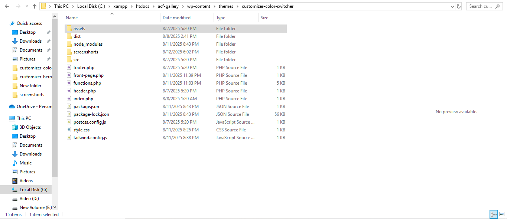
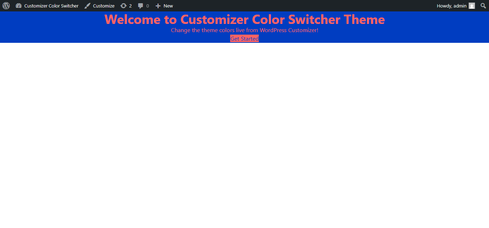
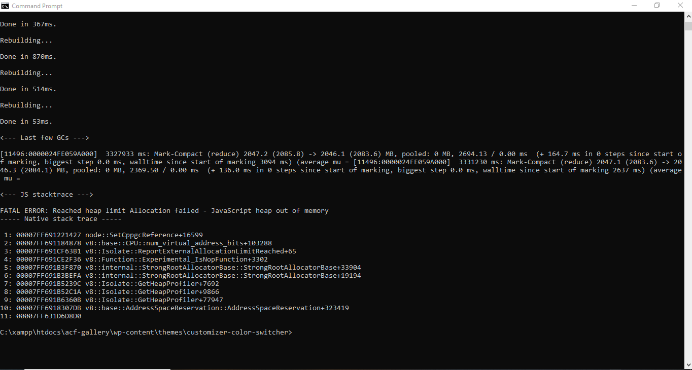

# 🎨 Customizer Color Switcher Theme

A WordPress theme with **Customizer color picker + live CSS variable-based color change** using Tailwind CSS.  
Easily change hero section title, subtitle, button text, URL, and theme colors **live** from the WordPress Customizer.

---

## 📂 Theme Folder Structure

```plaintext
customizer-color-switcher/
├── assets/                     # Theme assets like JS, images, fonts
├── dist/                       # Compiled CSS & JS files (e.g., Tailwind output)
├── screenshots/                # Theme screenshots for WordPress dashboard
│   ├── theme-folder-structure.png
│   ├── screenshot-customizer-ui.png
│   ├── screenshot-frontend-hero.png
│   └── screenshot-tailwind-build.png
├── src/                        # Source files (JS, CSS, components)
├── footer.php                  # Theme footer template
├── front-page.php              # Front page template
├── functions.php               # Theme functions file (enqueue scripts, customizer, etc.)
├── header.php                  # Theme header template
├── index.php                   # Main template file
├── package.json                # NPM package configuration
├── package-lock.json           # NPM package lock file
├── postcss.config.js           # PostCSS config (for Tailwind CSS)
├── style.css                   # Main stylesheet (theme meta info + custom styles)
├── tailwind.config.js          # Tailwind CSS configuration file

---
🖼️ Screenshots

| Theme Folder Structure | Customizer UI | Frontend Hero Section | Tailwind Build |
|------------------------|--------------|-----------------------|----------------|
|  |  |  |  |

---

⚡ Features
🎨 Theme Color Switcher via WordPress Customizer

🖌 Live Preview with JavaScript & wp.customize API

💨 Tailwind CSS Integration with PostCSS build

📱 Fully responsive hero section layout

🛠 Easy to customize and extend

---

📦 Installation
Download or clone the repository.

Place the folder inside /wp-content/themes/.

Activate the theme from Appearance > Themes in WordPress.

Go to Appearance > Customize to change hero section content & theme colors.

---

## 🛠️ Build Tailwind CSS
To update styles after editing `src/input.css` or Tailwind config:
```bash
npx tailwindcss -i ./src/input.css -o ./dist/style.css --watch

👨‍💻 Developed By
Mahbub Shaki
WordPress Theme Developer | Tailwind CSS Enthusiast
🌐 Upwork Profile: https://www.upwork.com/freelancers/~015df70a23d7f58180
📧 mahbubshaki64@gmail.com