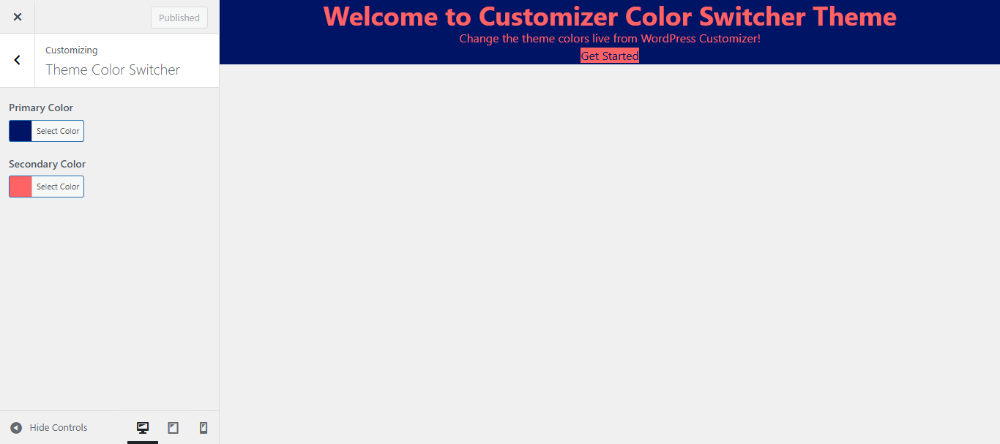

# 🎨 Customizer Color Switcher Theme

A WordPress theme with **Customizer color picker + live CSS variable-based color change** using Tailwind CSS.  
Easily change hero section title, subtitle, button text, URL, and theme colors **live** from the WordPress Customizer.

---

# 🎨 Theme Folder Structure – `customizer-color-switcher`
📂 customizer-color-switcher/
├── 📁 assets/ # 🎯 Theme assets like JS, images, fonts
├── 📁 dist/ # ⚡ Compiled CSS & JS files (Tailwind output)
├── 📁 screenshots/ # 📸 Theme screenshots for WordPress dashboard
│ ├── 🖼️ theme-folder-structure.png
│ ├── 🖼️ screenshot-customizer-ui.png
│ ├── 🖼️ screenshot-frontend-hero.png
│ └── 🖼️ screenshot-tailwind-build.png
├── 📁 src/ # 🛠 Source files (JS, CSS, components)
├── 📄 footer.php # 🔻 Theme footer template
├── 📄 front-page.php # 🏠 Front page template
├── 📄 functions.php # ⚙️ Theme functions (enqueue, customizer, etc.)
├── 📄 header.php # 🔺 Theme header template
├── 📄 index.php # 📃 Main template file
├── 📄 package.json # 📦 NPM package configuration
├── 📄 package-lock.json # 🔒 NPM package lock file
├── 📄 postcss.config.js # 🧵 PostCSS config (Tailwind CSS)
├── 📄 style.css # 🎨 Main stylesheet (theme meta info + custom styles)
└── 📄 tailwind.config.js # 🎯 Tailwind CSS configuration file
---

## 🖼️ Screenshots

| Theme Folder Structure | Customizer UI | Frontend Hero Section | Tailwind Build |
|------------------------|--------------|---------------------|----------------|
|  |  |  |  |

---

## ⚡ Features
- 🎨 Theme Color Switcher via WordPress Customizer
- 🖌 Live Preview with JavaScript & wp.customize API
- 💨 Tailwind CSS Integration with PostCSS build
- 📱 Fully responsive hero section layout
- 🛠 Easy to customize and extend

---

## 📦 Installation
1. Download or clone the repository.  
2. Place the folder inside `/wp-content/themes/`.  
3. Activate the theme from **Appearance > Themes** in WordPress.  
4. Go to **Appearance > Customize** to change hero section content & theme colors.

---

## 🛠️ Build Tailwind CSS
To update styles after editing `src/input.css` or Tailwind config:
```bash
npx tailwindcss -i ./src/input.css -o ./dist/style.css --watch
```

### 👨‍💻 Footer Info
**Mahbub Shaki**  
WordPress Theme Developer | Tailwind CSS Enthusiast  
🌐 [Upwork Profile](https://www.upwork.com/freelancers/~015df70a23d7f58180)  
📧 mahbubshaki64@gmail.com


---